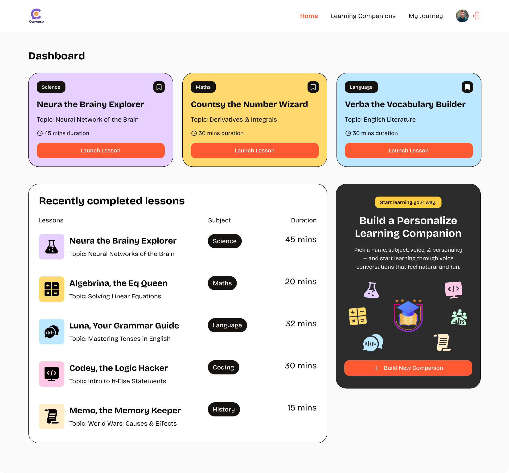
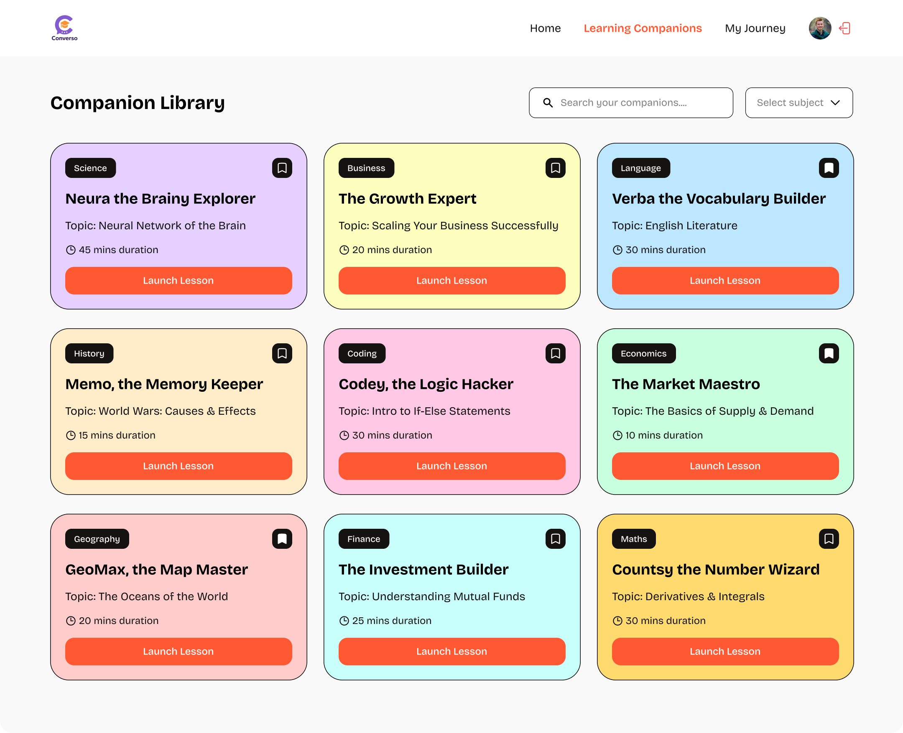
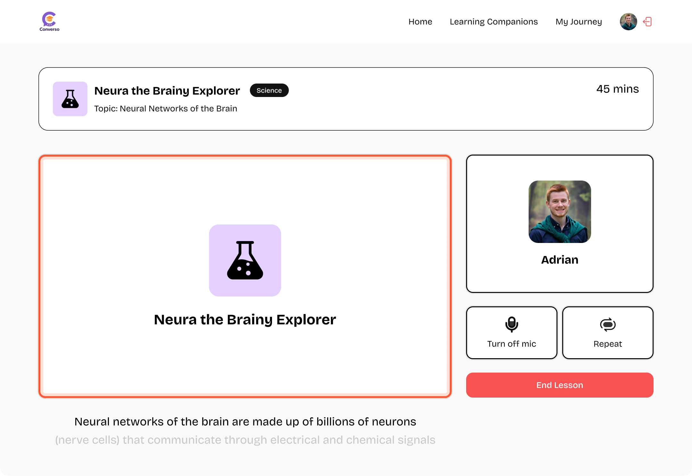
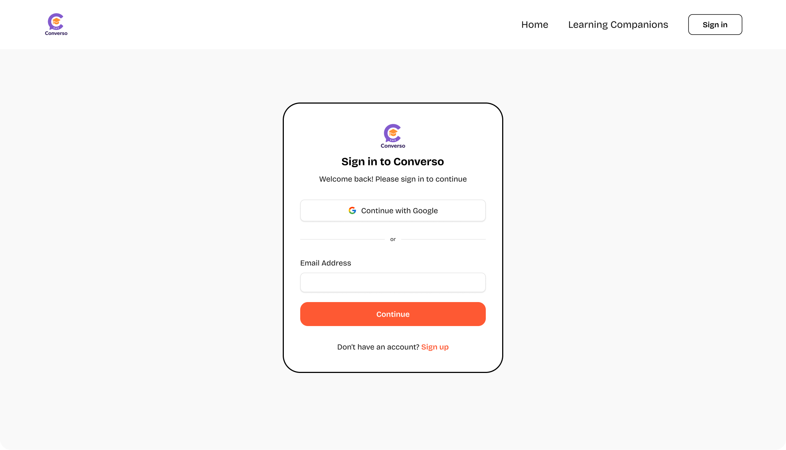

<div align="center">
  
  <h1>AI Tutor SaaS Platform</h1>
  <p>
    An intelligent, voice-powered Learning Management System (LMS) where users can learn about a variety of subjects by having real-time conversations with AI-powered companions.
  </p>
  <br />
  
</div>

<!-- ABOUT THE PROJECT -->

## 🚀 About The Project

This project is a fully-featured Software-as-a-Service (SaaS) application that redefines online learning. Instead of passive video courses, users can select an AI "Companion" specializing in a particular subject and topic, and start a dynamic, voice-based conversation. The platform handles everything from user authentication and subscriptions to the complex, real-time AI interactions.

---

## ✨ Features Showcase

<table>
  <tr>
    <td align="center">
      <h3>Discover & Filter Companions</h3>
      
      <p>Easily browse, search, and filter through a library of AI tutors for any subject.</p>
    </td>
    <td align="center">
      <h3>Interactive Learning Sessions</h3>
      
      <p>Engage in real-time, voice-based conversations with your chosen AI companion.</p>
    </td>
  </tr>
  <tr>
    <td align="center">
      <h3>Companion Builder</h3>
      
      <p>Create your own custom AI tutors with specific subjects, topics, and conversational styles.</p>
    </td>
    <td align="center">
      <h3>Subscription & Usage Limits</h3>
      
      <p>The platform manages user access with subscription-based limits on features like companion creation.</p>
    </td>
  </tr>
    <tr>
    <td align="center">
      <h3>Personalized Journey</h3>
      
      <p>Track your learning progress and review past sessions in your personalized journey.</p>
    </td>
    <td align="center">
      <h3>Secure Authentication</h3>
      
      <p>Secure and simple user sign-up and sign-in powered by Clerk.</p>
    </td>
  </tr>
</table>

<br/>

### 🛠️ Tech Stack

This project is built with a modern, robust tech stack:

- **Framework:** [Next.js](https://nextjs.org/) (with React)
- **Styling:** [Tailwind CSS](https://tailwindcss.com/)
- **Database:** [Supabase](https://supabase.io/)
- **User Management & Auth:** [Clerk](https://clerk.com/)
- **Voice AI Platform:** [Vapi](https://vapi.ai/)
- **Text-to-Speech:** [ElevenLabs](https://elevenlabs.io/)
- **Speech-to-Text:** [Deepgram](https://deepgram.com/)
- **Language:** [TypeScript](https://www.typescriptlang.org/)
- **Form Management:** [React Hook Form](https://react-hook-form.com/) & [Zod](https://zod.dev/)

---

## 🏁 Getting Started

To get a local copy up and running, follow these simple steps.

### Prerequisites

Make sure you have Node.js and npm (or yarn/pnpm) installed on your machine.

### Installation

1.  **Clone the repository:**

    ```sh
    git clone https://github.com/your_username/lms-saas-app.git
    cd lms-saas-app
    ```

2.  **Install NPM packages:**

    ```sh
    npm install
    ```

3.  **Set up your environment variables:**
    Create a file named `.env.local` in the root of your project and add the following variables. You will need to get these API keys from their respective platforms.

    ```env
    # Clerk
    NEXT_PUBLIC_CLERK_PUBLISHABLE_KEY=
    CLERK_SECRET_KEY=

    # Supabase
    NEXT_PUBLIC_SUPABASE_URL=
    NEXT_PUBLIC_SUPABASE_ANON_KEY=

    # Vapi
    VAPI_API_KEY=
    ```

4.  **Run the development server:**

    ```sh
    npm run dev
    ```

    Open [http://localhost:3000](http://localhost:3000) with your browser to see the result.

---

## 📄 License

Distributed under the MIT License. See `LICENSE` for more information.


Project Link: [https://github.com/amaan-ur-raheman/lms-saas-app](https://github.com/amaan-ur-raheman/lms-saas-app)
